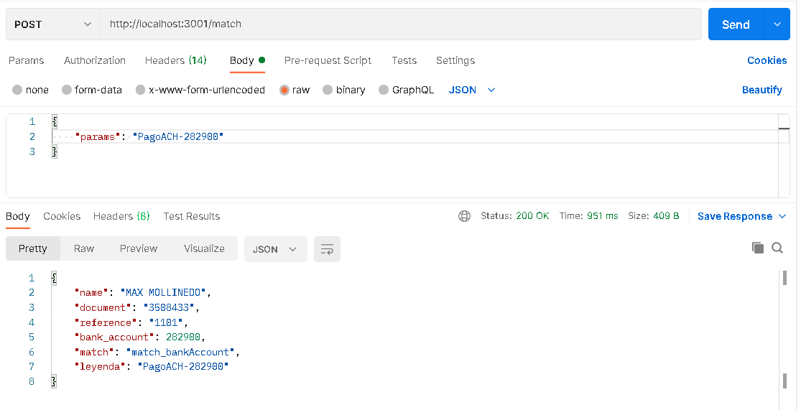

# Neivor-Case -Documentation
### ¿QUIÉN HIZO EL PAGO? - Caso de estudio
----------

## Introduction
This Api helps to find information about payments registered in an account summary. It is common for the legends in bank summaries to contain abbreviated information and it is difficult to know who the payment belongs to.

## General description
Developed in Node.js
This api receives a legend and searches the database provided (in this case by Neivor) for any coincidence that allows us to know if the payment belongs to a user registered in the database.

-----

## Endpoint
#### This enpoint will return an object with the owner's data that is found in the database and has had a match with the string "Legend".

POST:
http://localhost:3001/match

#### For it to work properly

1. The method to use to make the request is POST
2. A string "Legend" must be sent with the request.
3. The answer is it will be an object with the owner's data or a string "there were no matches"


#### For example: request to server using axios

```javascript
import axios from "axios"

export async function getMatch(leyenda) {
  
    const respuesta = await axios.post("http://localhost:3001/match", leyenda)
   return respuesta.data
}
```
#### If you want use Postman:
The Legend must be sent by body request, and in the raw config put an object with the property "params"

<p> 

</p>

